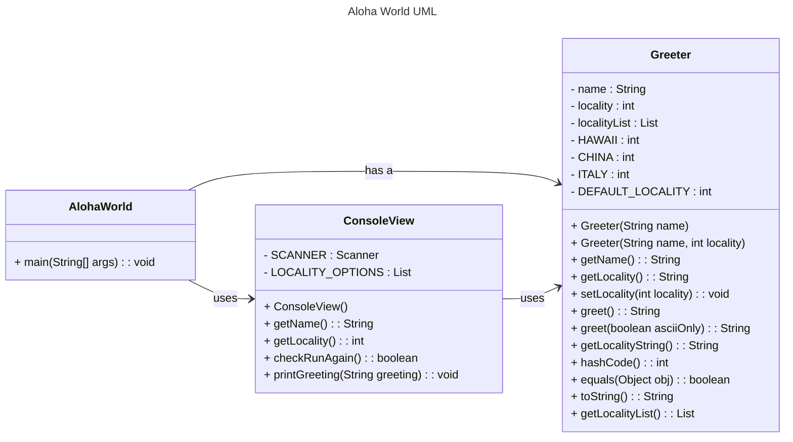

# Homework Aloha World Report

The following report contains questions you need to answer as part of your submission for the homework assignment. 

## Design Doc
Please link your UML design file here. See resources in the assignment on how to
link an image in markdown. You may also use [mermaid] class diagrams if you prefer, if so, include the mermaid code here.  You DO NOT have to include Greeting.java as part of the diagram, just the AlohaWorld application that includes: [AlohaWorld.java], [Greeter.java], and [ConsoleView.java].

### Program Flow
Write a short paragraph detailing the flow of the program in your own words. This is to help you understand / trace the code (and give you practice of something called a code walk that will be required in this course).

As soon as we hit the run button in AlohaWorld.java, a "Welcome, what is your name? " string will pop up in the terminal.
After we type in our name and choose a locality, the program will send the name and locality as parameters to Greeter.java and 
create a Greeter object called greeter. Depending on the locality that we chose, the greet method in Greeter.java will return
a string in either English, Chinese, Italian, or Hawaiian. The program then send this greeting to ConsoleView.java and use the printGreeting
method to print out the greeting in terminal. Last, the program will ask us whether we want to rerun the program or not.
If we chose yes, the program will ask us what's our locality again and set the new locality using setLocality nethod in Greeter.java then
print out the result. If not, the program ends here. However, the while loop is not written in the way as it's intented. If we did really choose yes, the program will be shut down because of the condition code on line 52 in AlohaWorld.java. We need to delete the exclamation mark in order to get the result we want.

## Assignment Questions

1. List three additional java syntax items you didn't know when reading the code.  (make sure to use * for the list items, see example below, the backtick marks are used to write code inline with markdown)
   
   * (example) `final class`
   * `static`
   * `List<String>`
   * `package`

2. For each syntax additional item listed above, explain what it does in your own words and then link a resource where you figured out what it does in the references section. 

    * (example) The `final` keyword when used on a class prevents the class from being subclassed. This means that the class cannot be extended by another class. This is useful when you want to prevent a class from being modified or extended[^1] . It is often the standard to do this when a class only contains static methods such as driver or utility classes. Math in Java is an example of a final class[^2] .
    
    * The `static` keyword is used for a constant variable or a method that is the same for every instance of a class. That means that evetytime you create an object from this class, the stactic varialbe or method would be the same. The best part about using the static keyword is that the stactic varialbe or method share memory allocation. Whenever you create as many objects as possible from the class, the stactic varialbe or method would take up only one memory space.[^3]

    * The `List<String>` keyword when used creates a ordered collections of Strings. The order of the list is the order when the Strings are added. You can have dupilcate elements in the list and can be accessed by the indexs.[^4]

    * Package encapsulates a group of classes, sub-packages, and interfaces. Implementing packages can help us prevent naming conflicts so that classes with same name can exist in different packages. And this also help us organize our classes, interfaces, and other components.[^5]

3. What does `main` do in Java? 

    `main` is the starting point when JVM executes a java program.

4. What does `toString()` do in Java? Why should any object class you create have a `toString()` method?

    `toString()` returns Strings. It is useful when the class you used has a toString() method. Because by calling the method, you can get the String type of the obejct you need and you won't have to cast the object to String by yourself.

5. What is javadoc style commenting? What is it used for? 

    /** ...*/ is javadoc style commenting. It is used to create javadoc and javadoc is used for people understanding your code easier.

6. Describe Test Driving Development (TDD) in your own words. 

    Test Driving Development is a method used by programmers when writing code. Programmers create test cases first, and then write the code in order to pass the scenerio that test cases provide.

7. Go to the [Markdown Playground](MarkdownPlayground.md) and add at least 3 different markdown elements you learned about by reading the markdown resources listed in the document. Additionally you need to add a mermaid class diagram (of your choice does not have to follow the assignment. However, if you did use mermaid for the assignment, you can just copy that there). Add the elements into the markdown file, so that the formatting changes are reserved to that file. 

## Deeper Thinking Questions

These questions require deeper thinking of the topic. We don't expect 100% correct answers, but we encourage you to think deeply and come up with a reasonable answer. 

1. Why would we want to keep interaction with the client contained to ConsoleView?

    I think it's good practice to keep a class focused on one specific purpose. By doing so, we can maintain the package easier. Since every class has it's own purpose, we can find the problem easily when debugging. If we don't keep each class focused on a single purpose, the logic will become tangled, and we'll end up spending a lot of time modifying the code.

2. Right now, the application isn't very dynamic in that it can be difficult to add new languages and greetings without modifying the code every time. Just thinking programmatically,  how could you make the application more dynamic? You are free to reference Geeting.java and how that could be used in your design.

    I think we need to design an entry point for users to add new languages and their corresponding greetings, and we also need to modify the program to catch whatever users input and print out the correct greetings. We can use the Greeting.java to achieve this. But first we need to modify the ConsoleView.java, creating a method that ask user to add new languages, greetings and the format of greetings. After adding a new method, we can print out different greeting using Greeting.java by depending on what kind of input users give us since we have three kinds of constructor in Greeting.java. The first constructor gives an English version of greeting. The second one gives a greeting that users provide in a "%s, %%s!" format. The last one gives a greeting that fully depends on what users provide. Finally, we make our application dynamic.

> [!IMPORTANT]
>  After you upload the files to your github (ideally you have been committing throughout this progress / after you answer every question) - make sure to look at your completed assignment on github/in the browser! You can make sure images are showing up/formatting is correct, etc. The TAs will actually look at your assignment on github, so it is important that it is formatted correctly.

## References

[^1]: Final keyword in Java: 2024. https://www.geeksforgeeks.org/final-keyword-in-java/. Accessed: 2024-03-30. 

[^2]: Math (Java Platform SE 17). https://docs.oracle.com/en/java/javase/17/docs/api/java.base/java/lang/Math.html. Accessed: 2024-03-30.

[^3]: static Keyword in Java. https://www.geeksforgeeks.org/static-keyword-java/

[^4]: Java List Interface. https://www.geeksforgeeks.org/list-interface-java-examples/

[^5]: Java Packages. https://www.geeksforgeeks.org/packages-in-java/

<!-- This is a comment, below this link the links in the document are placed here to make ti easier to read. This is an optional style for markdown, and often as a student you will include the links inline. for example [mermaid](https://mermaid.js.org/intro/syntax-reference.html) -->
[mermaid]: https://mermaid.js.org/intro/syntax-reference.html
[AlohaWorld.java]: src/main/java/student/AlohaWorld.java
[Greeter.java]: src/main/java/student/Greeter.java
[ConsoleView.java]: src/main/java/student/ConsoleView.java